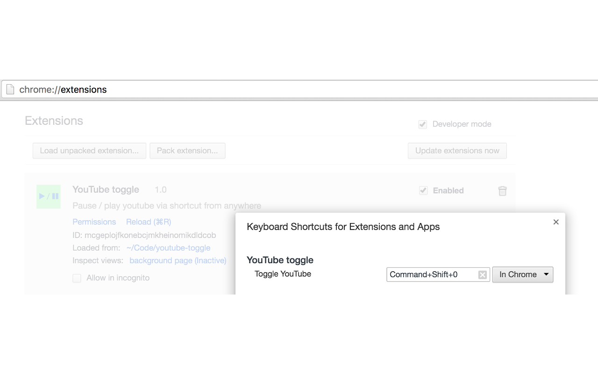

# youtube-toggle
Pause / play youtube via shortcut while you are in a different tab

## Installation

Go to the [plugin page in the chrome webstore](https://chrome.google.com/webstore/detail/youtube-toggle/hpfgcckhlgfbajmpcfbdidecbfmmccjj) and click the *Add to Chrome* button.
